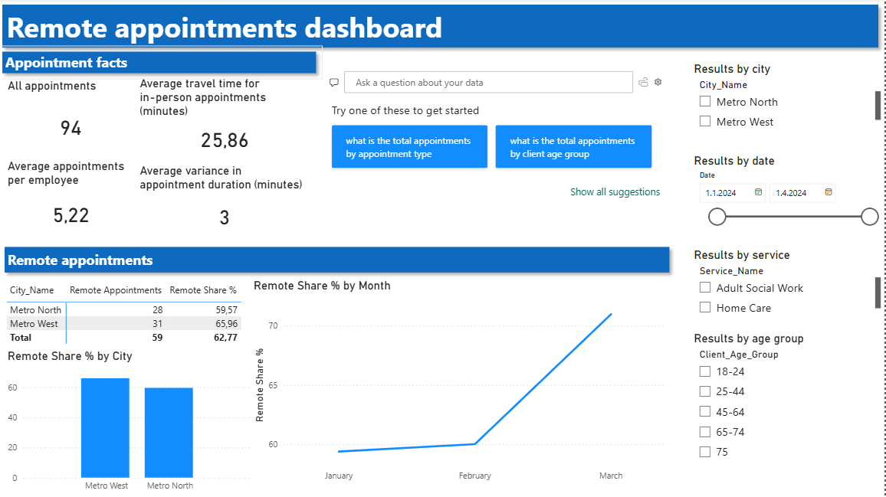

# Digital vs In-Person Healthcare Appointments

## Introduction

This project analyzes the share of remote versus in-person healthcare appointments in two fictional municipal areas: Metro North and Metro West.  

The purpose of the project is to demonstrate how operational service data can be transformed into structured KPIs and interactive dashboards to support strategic decision-making in social and healthcare services.

---

## Background

**Important notice:**  
All data and entities described in this project are entirely **fictional** and created solely for portfolio purposes.

The governing body of the social and healthcare system has set a strategic goal to improve service accessibility and operational efficiency. One key performance target is that:

> **At least 50% of appointments should be conducted remotely.**

The objective of increasing remote appointments is to:
- Reduce employee travel time  
- Improve operational efficiency  
- Increase service accessibility  

---

## Business Questions

To evaluate whether strategic goals are being met, the following questions were defined:

1. Have Metro North and Metro West achieved the target of at least 50% remote appointments?
2. How does remote appointment usage vary by client age group and service type?
3. Are there differences in employee workload between the cities?
4. How much travel time is associated with in-person visits, and how much could potentially be reduced?
5. What operational factors might explain differences between the cities?

---

## Tools Used

- **Microsoft Excel** – storing and structuring the raw dataset  
- **Power BI** – data cleaning (Power Query), data modeling, DAX calculations, and dashboard development  
- **Visual Studio Code** – documentation and project organization  
- **GitHub** – version control and project publication
- **ChatGPT** - configuring and cleaning the readme-file for improved readability

---

## Methodology

### 1. Business Understanding

The project began by defining measurable KPIs based on strategic goals (remote share %, travel time, workload per employee).

---

### 2. Data Preparation (Power Query)

The original dataset was structured as a single flat table.


Data cleaning included:
- Correcting data types (dates, numeric fields, categorical values)
- Removing rows with missing `Created_Timestamp` (mandatory for time-based analysis)
- Standardizing categorical values (e.g., appointment type, employee role)
- Creating derived columns such as duration variance

---

### 3. Data Modeling (Star Schema)

The flat dataset was transformed into a **star schema** consisting of:

- **Fact table:** `Fact_Appointments`
- **Dimension tables:** `Dim_Client`, `Dim_Employee`, `Dim_Service`, `Dim_City`, `Dim_Date`


This modeling approach:
- Removes redundant descriptive data
- Ensures atomic structure
- Improves scalability and clarity
- Enables efficient filtering and time intelligence

A dedicated **Date dimension table** was created to support proper time-based analysis.

Relationships were built using primary and foreign keys following relational database design principles.


---

### 4. KPI Development (DAX)

Core measures created include:

- Total Appointments  
- Remote Appointments  
- Remote Share (%)  
- Appointments per Employee  
- Average Travel Time (In-Person)  
- Duration Variance (Actual vs Planned)  

These measures translate strategic goals into quantifiable performance indicators.

A sample of one of the DAX measures created, where Remote Appointments is another measure calculating remote appointments, Total Appointments all appointments:

```
Remote Share % = DIVIDE([Remote Appointments], [Total Appointments]) * 100

```

---

### 5. Dashboard Design

The dashboard was designed to be clear and manager-friendly, including:

- KPI cards (remote share %, total appointments)
- Remote share comparison by city
- Service and age group segmentation
- Travel time analysis
- Employee workload comparison
- Interactive slicers (city, service, age group, time)




---

## Analysis

### 1. Target Achievement

Both Metro North and Metro West achieved the overall 50% remote appointment target during the analysis period (January 2nd – March 31st).

However, segmentation revealed important variations.

---

### 2. Differences by Age Group

In the 45–64 age group in Metro West, only approximately 14% of appointments were conducted remotely.

This suggests structural or service-level differences that warrant further investigation.

---

### 3. Service-Level Variation

In Metro North, home care services fell approximately 7 percentage points below the 50% target, while in Metro West, adult social work services were about 17 percentage points below the target.

These differences may reflect variations in service characteristics, client needs and/or operational practices between the areas.

---

### 4. Employee Workload

Average appointments per employee:
- Metro North: 4.70  
- Metro West: 5.88  

While differences exist, they are not extreme.

---

### 5. Travel Time Impact

The average travel time for in-person visits was approximately 26 minutes.

Given the relatively short distances in both cities, operational route optimization and scheduling efficiency may offer improvement potential.

---

### 6. Potential Explanatory Factors

Differences between cities may be influenced by:

- Client case complexity
- Service mix
- Employee role distribution
- Operational practices
- Digital readiness of staff and clients

Further data would be required to validate these hypotheses.

---

## Conclusions

### Key Findings

- Both cities achieved the strategic 50% remote target overall.
- Significant variation exists within certain age groups and services.
- Travel time represents a measurable efficiency opportunity.
- Workload differences between cities are moderate.

---

### Recommendations

- Conduct deeper analysis of the 45–64 age group in Metro West.
- Evaluate digital capability and readiness among staff and clients.
- Assess route planning and travel optimization practices.
- Expand remote service models in service categories where appropriate.

---

## Learning Outcomes

Through this project, I strengthened my skills in:

- Data cleaning and transformation in Power Query  
- Designing star schema data models  
- Building relational table structures  
- Developing KPIs using DAX  
- Designing clear and interactive dashboards  
- Translating data insights into actionable recommendations  

---

## Final Reflection


This project demonstrates how operational healthcare data can be structured, modeled, and analyzed to support evidence-based decision-making and strategic performance management.

